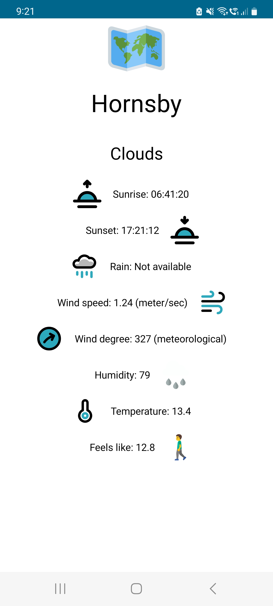
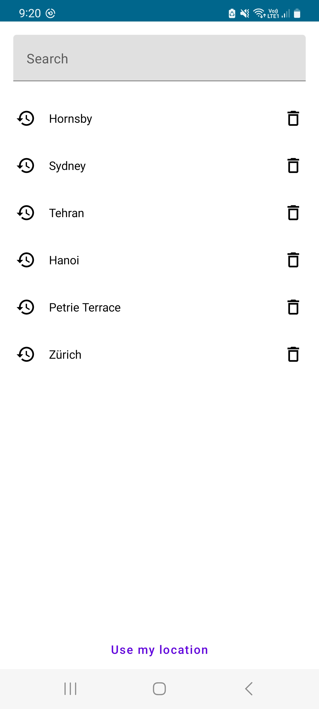

# Task

1. Search by city name or post code
   Implement a search to allow the user to enter a city name or post code. The result of the
   search is to display the current weather information for the searched location.
2. Recent Searches
   Implement a screen that lists recently searched locations. You can tap on a recent search
   location and see the current weather location.
3. Delete recent searches
   Provide the ability to delete one or more recently searched locations.
   Hard requirements:
   
   ● Use the OpenWeatherMap API: http://openweathermap.org/api
   
   ○ Use a json payload.
   
   ● Unit test your code.

## Installation

Please clone the code and compile it in [Android Studio](https://developer.android.com/studio).

## Requirements

I have created my own API key because the one which is provided had 401 errors. I believe few other
people were using it.

## Technologies & Methodologies which used:

- Jetpack Compose
- Coroutines
- Hilt
- Flow
- Clean Architecture
- MVVM Pattern
- LiveData
- Espresso
- Room
- Mockk and JUnit
- Accessibility support
- Geocoder API

## Used libraries

- [retrofit](https://square.github.io/retrofit/)
- Required data models are created with the help of [Json to Kotlin convertor](https://json2kt.com/)

## Steps and Technical challenges

1. Making decision on necessary dependencies: Retrofit/Weather repository/LocationTracker/Room
2. Creating Weather models
3. Creating Dao and Entity for Room
4. Creating location tracker with permission management
5. Creating repositories for database and weather api call
6. Creating use case for api call to encapsulate logic
7. Creating viewModel based on injected dependencies
8. Load cities from DB and pass them to composables by flow (viewModel)
9. Creating functions to add/delete/query data (viewModel)
10. Creating api calls and updating UI state based on the response (viewModel)
11. Error handling (viewModel)
12. Android.Location.Geocoder will change zip code to suburb name - As discussed, zip codes are
Australians only
13. Creating navigation graphs for composables, although we have only one page (composable). I
change composables from viewModel, there is no need to call navigateTo().
14. Creating composable UI to show list of cities with the ability to delete and select a city (
composable)
15. Creating a composable UI to show weather conditions (composable)
16. Creating extension function in viewModel to show readable data to user
17. Unit test by creating fake dependencies, injecting them into the viewModel and call some
function to test

- Manage state with Unidirectional Data Flow:
  UI state is an immutable snapshot of the details needed for the UI to render might change over
  time due to user interaction or other events. ViewModel type is the recommended implementation for
  the management of screen-level UI state with access to the data layer. Furthermore, it survives
  configuration changes automatically. ViewModel classes define the logic to be applied to events in
  the app and produce updated state as a result.
- In this app we use Flow to send data from domain layer to UI layer. There are two actions in our
  repository, `read/add/delete cities` and `call api for current weather`. They flow data to
  vieMModel. ViewModel converts that data to UI states. Follow flowing data, state will be updated
  and Composable items are observing states. When something is changed in the state, Ui will be
  automatically updated.

There is also another layer of data flow between viewModel and composables. We trigger events with
this flow to tell UI we need to show a message to user.
